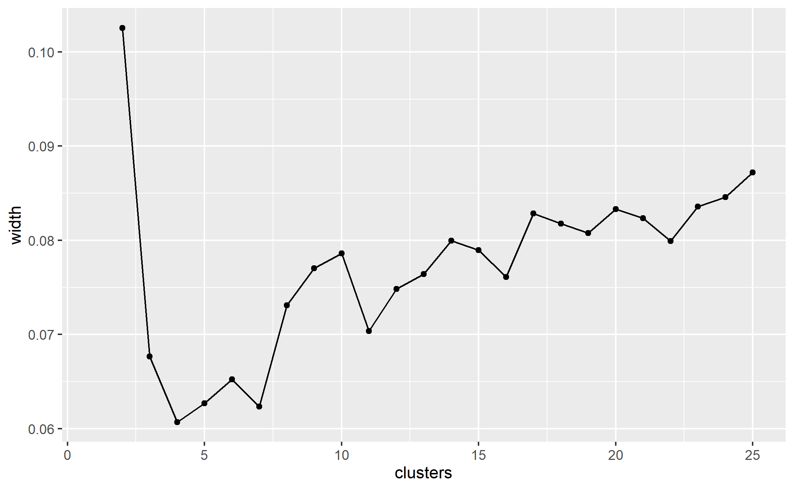
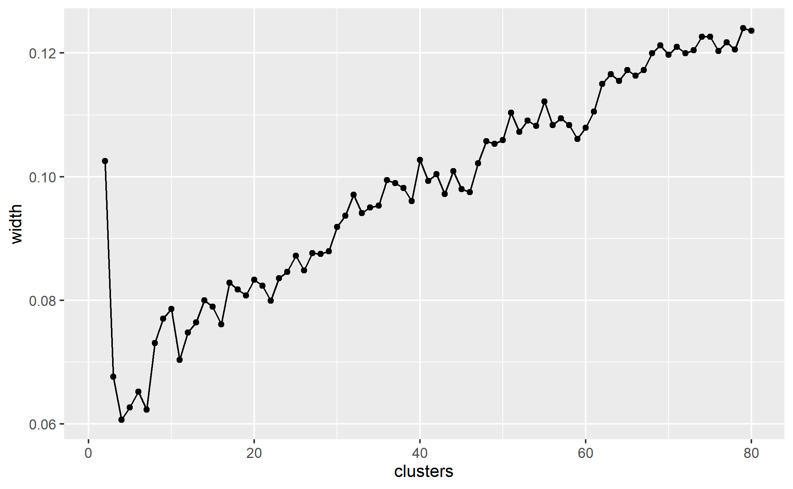
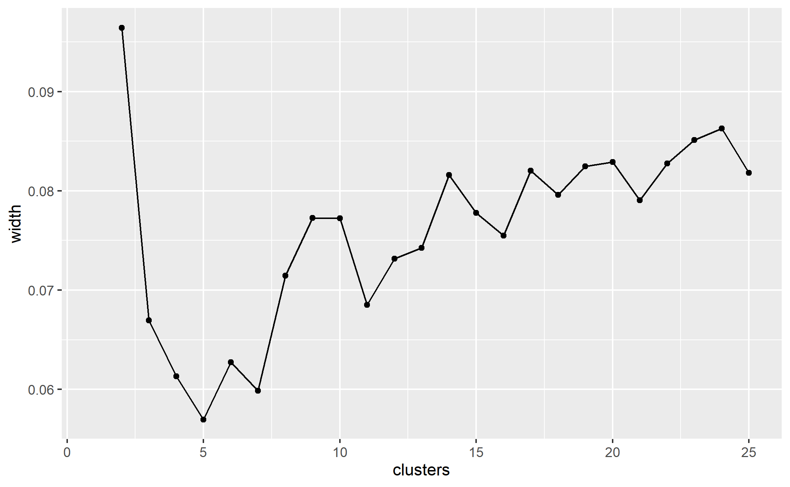

```{r setup, include=FALSE}
knitr::opts_chunk$set(echo = FALSE,
                      warning = FALSE,
                      message = FALSE)
```

# Data used
data files in "../xhpi_data_new/" are in three directories, one for each data-set.

* Neu_43_adv neutron diffraction
* Res_43_adv high resolution
* Temp_43_adv high temperature

Number of structures in each varies

Each protein has 3 files

* 7a3h.pdb
* 7a3h.hpml
* 7a3h.pdb.report
.report files are the plain text files containing information about the XH/pi interactions.

Geometric constraints for this data was d<7 and theta<50, although cut-offs of d<4.3 angstroms and theta<25 deg are often used to define XH/pi interactions,  so many of the interactions reported are not actually XH/pi interactions.

```{r pkgs}
library(tidyverse)
library(data.table)
library(cluster)
library(Rtsne)
```

```{r}
# IMPORT HIGH RES
directory <- "../xhpi_data_new/Res_43_adv/"
reports <- list.files(path = directory, pattern = "*.pdb.report")
number <- length(reports)

highres <- do.call("rbind", 
                   lapply(paste0(directory,"/", reports[1:number]),
                          function(x) read.table(x, 
                                                 header = TRUE,
                                                 stringsAsFactors = FALSE)))

# this results in 4305 interactions


# IMPORT NEUTRON DIFFRACTION
directory <- "../xhpi_data_new/Neu_43_adv/"
reports <- list.files(path = directory, pattern = "*.pdb.report")
number <- length(reports)

neutron <- do.call("rbind", 
                   lapply(paste0(directory,"/", reports[1:number]),
                          function(x) read.table(x, 
                                                 header = TRUE,
                                                 stringsAsFactors = FALSE)))

# this results in 772 interactions


# IMPORT HIGH TEMPERATURE
directory <- "../xhpi_data_new/Temp_43_adv/"
reports <- list.files(path = directory, pattern = "*.pdb.report")
number <- length(reports)

hightemp <- do.call("rbind", 
                   lapply(paste0(directory,"/", reports[1:number]),
                          function(x) read.table(x, 
                                                 header = TRUE,
                                                 stringsAsFactors = FALSE)))

# this results in 1788 interactions
```

## Number of interactions
* neutron diffraction: `r nrow(neutron)`
* high resolution:  `r nrow(highres)`
* high temperature:  `r nrow(hightemp)`

```{r eval=FALSE}
glimpse(neutron)
```
```{r eval=FALSE}
glimpse(highres)
```

```{r eval=FALSE}
glimpse(hightemp)
```

Note, we don't have resolution data for highres or hightemp

## Interaction types

Raw counts, not normalised

```{r}
# crosstabulate donor type and acceptor types
# highres
highressum <- highres %>% 
  group_by(x_atom_id, pi_res_id) %>% 
  count() 

ggplot(highressum, aes(x = x_atom_id, y = pi_res_id, fill = n)) +
  geom_tile() +
  ggtitle("High res") + 
  theme(axis.text.x = element_text(angle = 90))

# neutron
neutronsum <- neutron %>% 
  group_by(x_atom_id, pi_res_id) %>% 
  count()

ggplot(neutronsum, aes(x = x_atom_id, y = pi_res_id, fill = n)) +
  geom_tile() +
  ggtitle("Neutron") + 
  theme(axis.text.x = element_text(angle = 90))

# hightemp
hightempsum <- hightemp %>% 
  group_by(x_atom_id, pi_res_id) %>% 
  count()

ggplot(hightempsum, aes(x = x_atom_id, y = pi_res_id, fill = n)) +
  geom_tile() +
  ggtitle("High temp") + 
  theme(axis.text.x = element_text(angle = 90))
```

# Clustering mixed data types

Used R [@R-Core] with packages tidyverse [@tidyverse] and data.table [@data.table] to perform partitioning around medoids (PAM) [@kaufmanl1987clustering, kaufmanl1990clustering] to cluster based on Gower distance [@gower1971] both implemented in the cluster package [@cluster]  


* distance calculation - gower distance
* clustering algorithm - partitioning aroung medoids
* selecting the number of clusters - silhouette width

## neutron

Some variables will not used in clustering: 
* x_res_num
* x_atom_num
* pdb
* pi_res_num
* resolution

```{r}
# remove variables not used in clustering
neutron2 <- neutron %>%
  select(-x_res_num,
         -x_atom_num,
         -pdb,
         -pi_res_num,
         -resolution)

# char need to be converted to factors
neutron2 <- neutron2 %>% mutate_if(is.character,as.factor)
```

### Distance calculation, no variable transformations applied

```{r}
# calc distances without any transformations in first instance
gower_dist <- daisy(neutron2,
                    metric = "gower")
summary(gower_dist)
```
Which observations are least and most similar?

**most similar i.e., min disimilarity**
```{r}
gower_mat <- as.matrix(gower_dist)
neutron2[which(gower_mat == min(gower_mat[gower_mat != min(gower_mat)]),
               arr.ind = TRUE)[1, ], ]
```

**least similar i.e., max disimilarity**
```{r}
neutron2[which(gower_mat == max(gower_mat[gower_mat != max(gower_mat)]),
               arr.ind = TRUE)[1, ], ]
```


#### Cluster with PAM partitioning round medoids


```{r eval=FALSE}
cnum <- 25
sil_width <- data.frame(clusters = 1:cnum, width = NA)

for(i in 2:cnum){

  pam_fit <- pam(gower_dist,
                 diss = TRUE,
                 k = i)

  sil_width$width[i] <- pam_fit$silinfo$avg.width

}
```


The silhouette width, measure for selecting the number of clusters, was calculated for clusters ranging from 2 to `r cnum`
A higher silhouette width is better. Ideally, one sees it peak and fall again 


```{r eval = FALSE}
ggplot(sil_width, aes(x = clusters, y = width)) +
  geom_point() +
  geom_line()
ggsave("figs/neutron1.png")
```


```{r eval=FALSE}
cnum <- 80
sil_width <- data.frame(clusters = 1:cnum, width = NA)

for(i in 2:cnum){

  pam_fit <- pam(gower_dist,
                 diss = TRUE,
                 k = i)

  sil_width$width[i] <- pam_fit$silinfo$avg.width

}
```

Since the silhouette width was still increasing, I tried raising to 80.


```{r eval = FALSE}
ggplot(sil_width, aes(x = clusters, y = width)) +
  geom_point() +
  geom_line()
ggsave("figs/neutron2.png")
```


Possibly beginning to flatten but this many clusters is difficult to interpret and may be uninformative
Gower distance is sensitive to non-normality and extreme values in the continuous variable and transformations of these might help.
The continuous variables are: x_bfactor, pi_bfactor, Xdist, Xtheta, planar_angle, x_height and x_width. Their distributions are as follows:

```{r}
neutron2 %>% select(x_bfactor,
                    pi_bfactor,
                    Xdist,
                    Xtheta,
                    planar_angle,
                    x_height,
                    x_width) %>% 
  gather(key = variable, value = value) %>%  
  ggplot(., aes(x = value)) + 
  geom_density()  + 
  facet_wrap(. ~ variable, nrow = 2, scales = "free")
  
```
Log transformed variables have the following distributions

```{r}
neutron2 %>% select(x_bfactor,
                    pi_bfactor,
                    Xdist,
                    Xtheta,
                    planar_angle,
                    x_height,
                    x_width) %>% 
  gather(key = variable, value = value) %>%  
  ggplot(., aes(x = value)) + 
  geom_density()  + 
  scale_x_continuous(trans = "log2") +
  facet_wrap(. ~ variable, nrow = 2, scales = "free")
  
```

It appears that bfactors would benefit from log transformation when calculating the distances. These are straightfroawrd to apply so will be done first. x_width and xtheta might benefit from some transformation (squaring or ranking maybe).

### Distance calculation, transformed b-factors

```{r}
gower_dist <- daisy(neutron2,
                    metric = "gower",
                    type = list(logratio = c("x_bfactor",
                                             "pi_bfactor")))
summary(gower_dist)
```
Which observations are least and most similar?

**most similar i.e., min disimilarity**
```{r}
gower_mat <- as.matrix(gower_dist)
neutron2[which(gower_mat == min(gower_mat[gower_mat != min(gower_mat)]),
               arr.ind = TRUE)[1, ], ]
```

**least similar i.e., max disimilarity**
```{r}
neutron2[which(gower_mat == max(gower_mat[gower_mat != max(gower_mat)]),
               arr.ind = TRUE)[1, ], ]
```
#### Cluster with PAM partitioning round medoids


```{r eval=FALSE}
cnum <- 25
sil_width <- data.frame(clusters = 1:cnum, width = NA)

for(i in 2:cnum){

  pam_fit <- pam(gower_dist,
                 diss = TRUE,
                 k = i)

  sil_width$width[i] <- pam_fit$silinfo$avg.width

}
```


```{r eval = FALSE}
ggplot(sil_width, aes(x = clusters, y = width)) +
  geom_point() +
  geom_line()
ggsave("figs/neutron3.png")
```



```{r eval=FALSE}
cnum <- 80
sil_width <- data.frame(clusters = 1:cnum, width = NA)

for(i in 2:cnum){

  pam_fit <- pam(gower_dist,
                 diss = TRUE,
                 k = i)

  sil_width$width[i] <- pam_fit$silinfo$avg.width

}
```


```{r eval = FALSE}
ggplot(sil_width, aes(x = clusters, y = width)) +
  geom_point() +
  geom_line()
ggsave("figs/neutron4.png")

```

The b-factor transformation has made little impact.

Is this the same for the other structure determination methods?

## High resolution

Some variables will not used in clustering: 
* x_res_num
* x_atom_num
* pdb
* pi_res_num
* resolution

```{r}
# remove variables not used in clustering
highres2 <- highres %>%
  select(-x_res_num,
         -x_atom_num,
         -pdb,
         -pi_res_num,
         -resolution)

# char need to be converted to factors
highres2 <- highres2 %>% mutate_if(is.character,as.factor)
```

### Distance calculation, no variable transformations applied

```{r}
# calc distances without any transformations in first instance
gower_dist <- daisy(highres2,
                    metric = "gower")
summary(gower_dist)
```
Which observations are least and most similar?

**most similar i.e., min disimilarity**
```{r}
gower_mat <- as.matrix(gower_dist)
highres2[which(gower_mat == min(gower_mat[gower_mat != min(gower_mat)]),
               arr.ind = TRUE)[1, ], ]
```

**least similar i.e., max disimilarity**
```{r}
highres2[which(gower_mat == max(gower_mat[gower_mat != max(gower_mat)]),
               arr.ind = TRUE)[1, ], ]
```


#### Cluster with PAM partitioning round medoids

n.b. many more observations so clustering takes much longer
```{r eval=FALSE}
cnum <- 35
sil_width <- data.frame(clusters = 1:cnum, width = NA)

for(i in 2:cnum){

  pam_fit <- pam(gower_dist,
                 diss = TRUE,
                 k = i)

  sil_width$width[i] <- pam_fit$silinfo$avg.width

}
```


```{r eval = FALSE}
ggplot(sil_width, aes(x = clusters, y = width)) +
  geom_point() +
  geom_line()
ggsave("figs/highres1.png")

```


<!--  which observations are least and most similar -->
<!--  most similar i.e., min disimilarity -->
<!-- gower_mat <- as.matrix(gower_dist) -->
<!-- neutron2[which(gower_mat == min(gower_mat[gower_mat != min(gower_mat)]), -->
<!--                arr.ind = TRUE)[1, ], ] -->

<!--  least similar i.e., max disimilarity -->
<!-- neutron2[which(gower_mat == max(gower_mat[gower_mat != max(gower_mat)]), -->
<!--                arr.ind = TRUE)[1, ], ] -->


<!--  vis -->
<!-- tsne_obj <- Rtsne(gower_dist, is_distance = TRUE) -->

<!-- tsne_data <- tsne_obj$Y %>% -->
<!--   data.frame() %>% -->
<!--   setNames(c("X", "Y")) %>% -->
<!--   mutate(cluster = factor(pam_fit$clustering)) -->

<!-- ggplot(aes(x = X, y = Y), data = tsne_data) + -->
<!--   geom_point(aes(color = cluster)) -->


# references