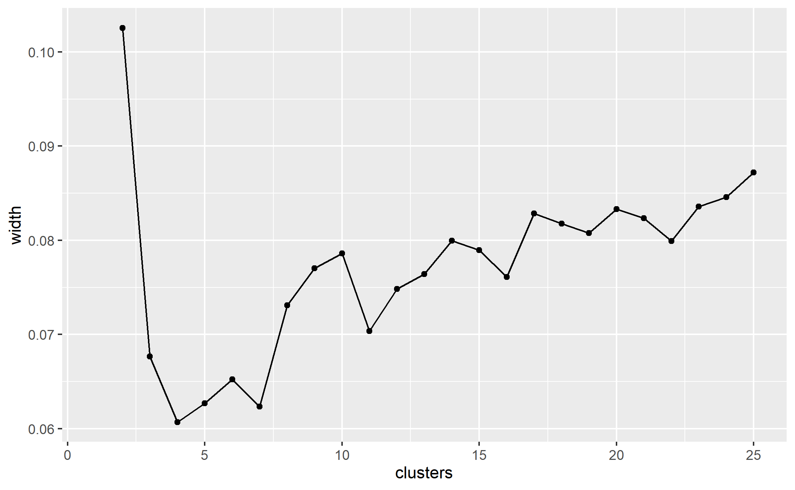
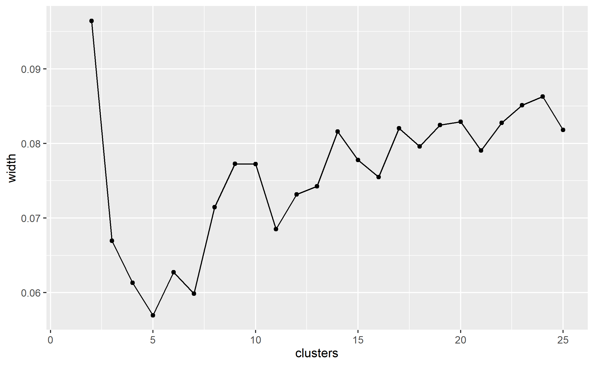

```{r setup, include=FALSE}
knitr::opts_chunk$set(echo = FALSE,
                      warning = FALSE,
                      message = FALSE)
```


```{r pkgs}
library(tidyverse)
library(data.table)
library(janitor)
library(cluster)
library(Rtsne)
library(GGally)
```

# Data used
data file in "../xhpi_data_v3/" 


```{r}
# IMPORT HIGH RES
file <- "../xhpi_data_v3/general_database_report.csv"
inters <- read.csv(file) %>% clean_names()

# tidy some variable. 
# turn resolution into a number
inters$resolution <- inters$resolution %>% as.character() %>% as.numeric()
no_resol <- summary(inters$resolution)["NA's"]
# calculate donor-accept separation
inters$seperation <- inters$x_res_num - inters$pi_res_num
glimpse(inters)
```
Database has `r nrow(inters)` interactions in `r length(unique(inters$pdb_id))` proteins. There are `r no_resol` without resolution. Donor/acceptor separation was calcaluated by x_res_num - pi_res_num.


```{r}
inters <- inters %>% filter(is.na(resolution)) %>% filter(resolution)
  group_by(pdb_id) %>% 
  count()
```


```{r}
intperprot <- inters %>% 
  group_by(pdb_id) %>% 
  count()
ggplot(data = intperprot, aes(x = n)) +
  geom_density() +
  xlab("Number of interactions") +
  ylab("Number of proteins")
```
# EDA
```{r eval=FALSE}
inters %>% 
  select(resolution,
         x_dist,
         x_theta,
         planar_angle,
         seperation) %>% 
  ggpairs()
ggsave("figs/eda.png")
```


## Interaction types

Raw counts, not normalised

```{r}
# crosstabulate donor type and acceptor types
# highres
interssum <- inters %>% 
  group_by(x_atom_id, pi_res_id) %>% 
  count() 

ggplot(interssum, aes(x = x_atom_id, y = pi_res_id, fill = n)) +
  geom_tile() +
  ggtitle("High res") + 
  theme(axis.text.x = element_text(angle = 90))

```


# Clustering mixed data types

Used R [@R-Core] with packages tidyverse [@tidyverse] and data.table [@data.table] to perform partitioning around medoids (PAM) [@kaufmanl1987clustering, @kaufmanl1990clustering] to cluster based on Gower distance [@gower1971] both implemented in the cluster package [@cluster]  


* distance calculation - gower distance
* clustering algorithm - partitioning aroung medoids
* selecting the number of clusters - silhouette width


```{r}
# select variables used in clustering
inters2 <- inters %>% 
  select(x_res_id, 
         x_atom_id, #replace with property
         x_dist,
         x_theta,
         planar_angle,
         pi_res_id,
         seperation) 

inters3 <- sample_n(inters2, 20000, replace = FALSE, prob = NULL)
```

Variables used in cluserting are: `r names(inters2)`


### Distance calculation, no variable transformations applied

```{r}
# calc distances without any transformations in first instance
gower_dist <- daisy(inters3,
                    metric = "gower")
summary(gower_dist)
```
Which observations are least and most similar?

**most similar i.e., min disimilarity**
```{r}
gower_mat <- as.matrix(gower_dist)
inters3[which(gower_mat == min(gower_mat[gower_mat != min(gower_mat)]),
               arr.ind = TRUE)[1, ], ]
```

**least similar i.e., max disimilarity**
```{r}
neutron2[which(gower_mat == max(gower_mat[gower_mat != max(gower_mat)]),
               arr.ind = TRUE)[1, ], ]
```


#### Cluster with PAM partitioning round medoids
```{r}
cnum <- 25
```


```{r eval=FALSE}

sil_width <- data.frame(clusters = 1:cnum, width = NA)

for(i in 2:cnum){

  pam_fit <- pam(gower_dist,
                 diss = TRUE,
                 k = i)

  sil_width$width[i] <- pam_fit$silinfo$avg.width

}
```


The silhouette width, measure for selecting the number of clusters, was calculated for clusters ranging from 2 to `r cnum`
A higher silhouette width is better. Ideally, one sees it peak and fall again 


```{r eval = FALSE}
ggplot(sil_width, aes(x = clusters, y = width)) +
  geom_point() +
  geom_line()
ggsave("figs/neutron1.png")
```




```{r}
cnum <- 80
```

```{r eval=FALSE}

sil_width <- data.frame(clusters = 1:cnum, width = NA)

for(i in 2:cnum){

  pam_fit <- pam(gower_dist,
                 diss = TRUE,
                 k = i)

  sil_width$width[i] <- pam_fit$silinfo$avg.width

}
```

Since the silhouette width was still increasing, I tried raising to 80.


```{r eval = FALSE}
ggplot(sil_width, aes(x = clusters, y = width)) +
  geom_point() +
  geom_line()
ggsave("figs/neutron2.png")
```


Possibly beginning to flatten but this many clusters is difficult to interpret and may be uninformative
Gower distance is sensitive to non-normality and extreme values in the continuous variable and transformations of these might help.
The continuous variables are: x_bfactor, pi_bfactor, Xdist, Xtheta, planar_angle, x_height and x_width. Their distributions are as follows:

```{r}
neutron2 %>% select(x_bfactor,
                    pi_bfactor,
                    Xdist,
                    Xtheta,
                    planar_angle,
                    x_height,
                    x_width) %>% 
  gather(key = variable, value = value) %>%  
  ggplot(., aes(x = value)) + 
  geom_density()  + 
  facet_wrap(. ~ variable, nrow = 2, scales = "free")
  
```

Log transformed variables have the following distributions

```{r}
neutron2 %>% select(x_bfactor,
                    pi_bfactor,
                    Xdist,
                    Xtheta,
                    planar_angle,
                    x_height,
                    x_width) %>% 
  gather(key = variable, value = value) %>%  
  ggplot(., aes(x = value)) + 
  geom_density()  + 
  scale_x_continuous(trans = "log2") +
  facet_wrap(. ~ variable, nrow = 2, scales = "free")
  
```

It appears that bfactors would benefit from log transformation when calculating the distances. These are straightfroawrd to apply so will be done first. x_width and xtheta might benefit from some transformation (squaring or ranking maybe).

### Distance calculation, transformed b-factors

```{r}
gower_dist <- daisy(neutron2,
                    metric = "gower",
                    type = list(logratio = c("x_bfactor",
                                             "pi_bfactor")))
summary(gower_dist)
```
Which observations are least and most similar?

**most similar i.e., min disimilarity**
```{r}
gower_mat <- as.matrix(gower_dist)
neutron2[which(gower_mat == min(gower_mat[gower_mat != min(gower_mat)]),
               arr.ind = TRUE)[1, ], ]
```

**least similar i.e., max disimilarity**
```{r}
neutron2[which(gower_mat == max(gower_mat[gower_mat != max(gower_mat)]),
               arr.ind = TRUE)[1, ], ]
```
#### Cluster with PAM partitioning round medoids

```{r}
cnum <- 25
```

```{r eval=FALSE}

sil_width <- data.frame(clusters = 1:cnum, width = NA)

for(i in 2:cnum){

  pam_fit <- pam(gower_dist,
                 diss = TRUE,
                 k = i)

  sil_width$width[i] <- pam_fit$silinfo$avg.width

}
```


```{r eval = FALSE}
ggplot(sil_width, aes(x = clusters, y = width)) +
  geom_point() +
  geom_line()
ggsave("figs/neutron3.png")
```



```{r}
cnum <- 80
```


```{r eval=FALSE}

sil_width <- data.frame(clusters = 1:cnum, width = NA)

for(i in 2:cnum){

  pam_fit <- pam(gower_dist,
                 diss = TRUE,
                 k = i)

  sil_width$width[i] <- pam_fit$silinfo$avg.width

}
```


```{r eval = FALSE}
ggplot(sil_width, aes(x = clusters, y = width)) +
  geom_point() +
  geom_line()
ggsave("figs/neutron4.png")

```

The b-factor transformation has made little impact.

Is this the same for the other structure determination methods?


## High temperature

Some variables will not used in clustering: 

* x_res_num
* x_atom_num
* pdb
* pi_res_num
* resolution
* pi_chain
* x_chain

```{r}
# remove variables not used in clustering
hightemp2 <- hightemp %>%
  select(-x_res_num,
         -x_atom_num,
         -x_chain,
         -pdb,
         -pi_res_num,
         -pi_chain,
         -resolution)

# char need to be converted to factors
hightemp2 <- hightemp2 %>% mutate_if(is.character,as.factor)
```

Variables used in cluserting are: `r names(hightemp2)`

### Relationships between variables
```{r}
hightemp2 %>% 
  select(-x_res_id,
         -x_atom_id) %>% 
  ggpairs() 
```

### Distance calculation, no variable transformations applied

```{r}
# calc distances without any transformations in first instance
gower_dist <- daisy(hightemp2,
                    metric = "gower")
summary(gower_dist)
```
Which observations are least and most similar?
  
**most similar i.e., min disimilarity**
```{r}
gower_mat <- as.matrix(gower_dist)
hightemp2[which(gower_mat == min(gower_mat[gower_mat != min(gower_mat)]),
               arr.ind = TRUE)[1, ], ]
```

**least similar i.e., max disimilarity**
```{r}
hightemp2[which(gower_mat == max(gower_mat[gower_mat != max(gower_mat)]),
               arr.ind = TRUE)[1, ], ]
```


#### Cluster with PAM partitioning round medoids
```{r}
cnum <- 35
```

```{r eval=FALSE}

sil_width <- data.frame(clusters = 1:cnum, width = NA)

for(i in 2:cnum){
  
  pam_fit <- pam(gower_dist,
                 diss = TRUE,
                 k = i)
  
  sil_width$width[i] <- pam_fit$silinfo$avg.width
  
}
```


```{r eval = FALSE}
ggplot(sil_width, aes(x = clusters, y = width)) +
  geom_point() +
  geom_line()
ggsave("figs/hightemp1.png")

```


Distributions of the continuous variables: x_bfactor, pi_bfactor, Xdist, Xtheta, planar_angle, x_height and x_width. 

```{r}
hightemp2 %>% select(x_bfactor,
                    pi_bfactor,
                    Xdist,
                    Xtheta,
                    planar_angle,
                    x_height,
                    x_width) %>% 
  gather(key = variable, value = value) %>%  
  ggplot(., aes(x = value)) + 
  geom_density()  + 
  facet_wrap(. ~ variable, nrow = 2, scales = "free")

```


### Distance calculation, transformed b-factors

```{r}
gower_dist <- daisy(hightemp2,
                    metric = "gower",
                    type = list(logratio = c("x_bfactor",
                                             "pi_bfactor")))
summary(gower_dist)
```
Which observations are least and most similar?
  
**most similar i.e., min disimilarity**
```{r}
gower_mat <- as.matrix(gower_dist)
hightemp2[which(gower_mat == min(gower_mat[gower_mat != min(gower_mat)]),
               arr.ind = TRUE)[1, ], ]
```

**least similar i.e., max disimilarity**
```{r}
hightemp2[which(gower_mat == max(gower_mat[gower_mat != max(gower_mat)]),
               arr.ind = TRUE)[1, ], ]
```
#### Cluster with PAM partitioning round medoids

```{r}
cnum <- 35
```

```{r eval=FALSE}

sil_width <- data.frame(clusters = 1:cnum, width = NA)

for(i in 2:cnum){
  
  pam_fit <- pam(gower_dist,
                 diss = TRUE,
                 k = i)
  
  sil_width$width[i] <- pam_fit$silinfo$avg.width
  
}
```


```{r eval = FALSE}
ggplot(sil_width, aes(x = clusters, y = width)) +
  geom_point() +
  geom_line()
ggsave("figs/hightemp2.png")
```


<!--  vis -->
<!-- tsne_obj <- Rtsne(gower_dist, is_distance = TRUE) -->

<!-- tsne_data <- tsne_obj$Y %>% -->
<!--   data.frame() %>% -->
<!--   setNames(c("X", "Y")) %>% -->
<!--   mutate(cluster = factor(pam_fit$clustering)) -->

<!-- ggplot(aes(x = X, y = Y), data = tsne_data) + -->
<!--   geom_point(aes(color = cluster)) -->


# references