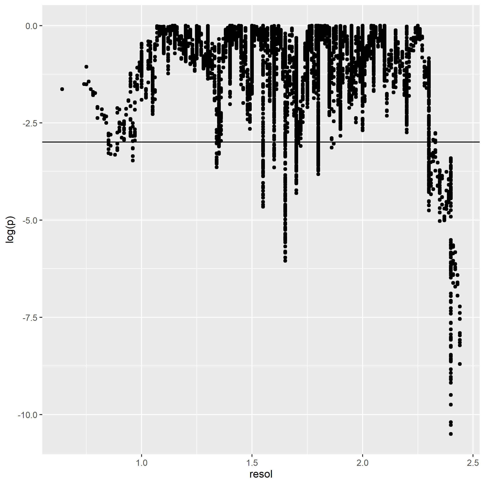

```{r setup, include=FALSE}
knitr::opts_chunk$set(echo = FALSE,
                      warning = FALSE,
                      message = FALSE)
```

```{r pkgs}
library(tidyverse)
library(data.table)
library(viridis)
library(MASS)
library(janitor)
```

```{r}
# Get density of points in 2 dimensions.
# @param x A numeric vector.
# @param y A numeric vector.
# @param n Create a square n by n grid to compute density.
# @return The density within each square.
get_density <- function(x, y, ...) {
  dens <- MASS::kde2d(x, y, ...)
  ix <- findInterval(x, dens$x)
  iy <- findInterval(y, dens$y)
  ii <- cbind(ix, iy)
  return(dens$z[ii])
}

```


```{r}
file <- "../xhpi_data_v3/xhpi_freq_res.csv"
resfreq <- read.csv(file) %>% clean_names()
#sort a dataframe
resfreq <- resfreq %>% arrange(resolution)
glimpse(resfreq)
```


```{r}
mod <- lm(data = resfreq, freq_per_100 ~ resolution)
intercept <- summary(mod)[["coefficients"]][1,1]
intercept_se <- summary(mod)[["coefficients"]][1,2]
slope <- summary(mod)[["coefficients"]][2,1]
slope_se <- summary(mod)[["coefficients"]][2,2]
```


```{r}
resfreq$density <- get_density(resfreq$resolution, 
                               resfreq$freq_per_100, n = 100)
ggplot(data = resfreq, aes(x = resolution, y = freq_per_100, colour = density)) +
  geom_point() +
  geom_smooth(method="lm")+
  scale_color_viridis() +
  geom_hline(yintercept = intercept) +
  geom_hline(yintercept = intercept + intercept_se) +
  geom_hline(yintercept = intercept - intercept_se)
```

# Regression
## Fixed first-500 window of sorted resolutions
```{r eval=FALSE}
window <-  500
# datframe will need to be sorted
dfall <- data.frame(x = double(),
                    y = double(),
                    fit = double(),
                    lwr = double(),
                    upr = double(),
                    win = integer())

p <- double()
slope <- double()
resol <- double()

for(i in 1:(nrow(resfreq)-window+1)) {
  rowstart <- i
  rowstop <- i + window - 1
  mod <- lm(data = resfreq[rowstart:rowstop,], freq_per_100 ~ resolution)
  pred <- predict(mod, interval = "predict")
  dftemp <- data.frame(resfreq[1:window,], pred, win = i)
  p[i] <- summary(mod)$coefficients[2, 4]
  slope[i] <- summary(mod)$coefficients[2, 1]
  resol[i] <- resfreq$resolution[i]
  dfall <- rbind(dfall, dftemp)
  }


res <- data.frame(p, slope, resol)

ggplot(data= res, aes(x = resol, y = log(p))) +
  geom_point() +
  geom_hline(yintercept = log(0.05))
ggsave("figs/reg500.png")
write.table(res, "proc_data/res500.txt")
```

Regressions were carried out for a moving window of 500 observations, i.e., the size of resolution window is dependent on the number of observations


## Fixed resolution window

For each 0.5 A window, 20 samples (with replacement) of 50 values were regressed

```{r}
# window boundaries
windows <- c(0.5, 0.75, 1.0, 1.25, 1.5, 1.75, 2.0, 2.25, 2.5, 2.75, 3.0)
# windows <- c(0.5, 1.5, 2.5, 3.5) 
# number in each sample
n <- 50
# number of samples
ns <- 100
# initialise vectors for p values, slope and se
slope = double()
se = double()
p = double()
# initialise results df
resultper <- data.frame(wstart = double(),
                        wstop = double(),
                        pop = integer(),
                        samplenum = integer(),
                        slope = double(),
                        se = double(),
                        p = double(),
                        q = double())
# set.seed(233)
for(i in 1:(length(windows) - 1) ) {
  wstart <- windows[i]
  wstop <- windows[i] + 0.5
  tempsample <- data.frame(wstart = double(),
                        wstop = double(),
                        pop = integer(),
                        samplenum = integer(),
                        slope = double(),
                        se = double(),
                        p = double(),
                        q = double())
  subset <- resfreq %>% 
    filter(resolution >= wstart, resolution < wstop)
  pop <- nrow(subset)
  for(j in 1:ns) {
    samplenum <- j
    subsetsample <- subset %>% 
      sample_n(n, replace = TRUE)
    mod <- lm(data = subsetsample, freq_per_100 ~ resolution)
    p[j] <- summary(mod)$coefficients[2, 4]
    slope[j] <- summary(mod)$coefficients[2, 1]
    se[j] <- summary(mod)$coefficients[2,2]
 #   print(c(wstart, wstop, pop, slope[j], se[j], p[j]))
    temp <- data.frame(wstart,
                       wstop,
                       pop,
                       samplenum,
                       slope = slope[j],
                       se = se[j],
                       p = p[j],
                       q = 0)
    
    tempsample <- rbind(tempsample, temp)
    tempsample$q <- p.adjust(tempsample$p, method = "hochberg")
  }
  resultper <- rbind(resultper, tempsample)
}


resultper$resband <- paste(resultper$wstart,":", resultper$wstop)

resultper$sigq <- TRUE
resultper$sigq[resultper$q > 0.05] <- FALSE
resultper$sigp <- TRUE
resultper$sigp[resultper$p > 0.05] <- FALSE
resultper$direction[resultper$slope > 0]  <- "Positive"
resultper$direction[resultper$slope < 0] <- "Negative"

```

```{r}

ggplot(resultper, aes(x = wstart, y = slope, color = sigp)) +
  geom_jitter(width = .2) +
  geom_hline(yintercept = 0) +
  xlab("Resolution window") +
  ylab("slope") +
  scale_color_manual(values = c("black", "pink"), 
                     name = "P Signifcance",
                     labels = c("NS", "p < 0.05")) +
  theme_classic()
```


```{r}

ggplot(resultper, aes(x = resband, y = slope, color = sigp)) +
  geom_jitter(width = .2) +
  geom_hline(yintercept = 0) +
  xlab("Resolution window") +
  ylab("slope") +
  scale_color_manual(values = c("black", "pink"), 
                     name = "P Signifcance",
                     labels = c("NS", "p < 0.05")) +
  theme_classic()
```
```{r}
ggplot(resultper, aes(x = wstart, y = slope, color = sigq)) +
  geom_jitter(width = .2) +
  geom_hline(yintercept = 0) +
  xlab("Resolution window") +
  ylab("slope") +
  scale_color_manual(values = c("black", "pink"), 
                     name = "FDR Signifcance",
                     labels = c("NS", "q < 0.05")) +
  theme_classic()
```

